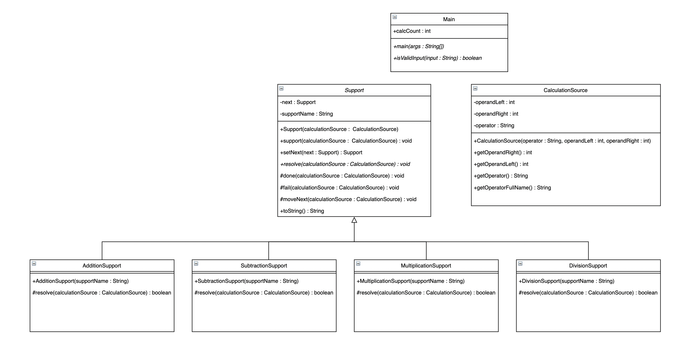

# Chain of Responsibility - Desgin

Chain of Responsibility 는 각 객체가 서로 연결되어 있어 한 객체는 자기 자신에게 주어진 작업만을 수행하고, 작업을 성공적으로 수행할 수 없다면 자신과 연결된 다음 객체에게 정보를 전달합니다. Chain of Responsibility 를 사용하면 각 객체(서버)가 하나의 작업에만 집중하도록 기능을 분리시킬 수 있다는 장점이 있습니다.

## UML

## Detail Description

### Support

Support 는 추상형 클래스로, 전체 연산들의 공통된 기능을 관리하고 각 연산들을 연결시켜 한 연산이 성공적으로 수행되지 못하면 다음 연산으로 연산자와 피연산자를 넘겨주는 역할을 합니다.

#### Variables

1. next : Support

   현재 연산 객체의 다음 연산 객체를 저장합니다.

2. supportName : String

   현재 연산 객체의 이름을 저장합니다.

#### Methods

1. setNext(next : Support) : Support

   현재 연산 객체의 다음 객체를 지정합니다.

2. support(calculationSource : CalculationSource) : void

   요청받은 연산 정보(CalculationSource)를 첫 연산 객체에게 전달합니다. 만약 true가 반환되면 성공메세지를 출력하며 종료하고, false가 반환되면 현재 연산 객체의 다음 객체에게 연산 정보를 전달합니다. 더 이상 전달할 연산 객체가 없다면, 실패했다는 메세지를 출력한 후 종료합니다.

3. resolve(calculationSource : CalculationSource) : void

   실제 연산이 이루어지는 추상 메서드입니다. Support 를 상속하는 각 클래스는 자신만의 resolve 를 정의하여 자신이 담당할 문제를 특정할 수 있습니다.

4. done(calculationSource : CalculationSource) : void

   연산이 성공적으로 종료되었다는 메세지를 출력합니다.

5. fail(calculationSource : CalculationSource) : void

   연산이 실패했다는 메세지를 출력합니다.

6. moveNext(calculationSource : CalculationSource) : void

   연산이 실패하여 다음 연산 객체에게 연산정보가 넘겨졌다는 메세지를 출력합니다.

### AdditionSupport

더하기 연산을 담당하는 클래스입니다. 더하기 결과를 출력하기 전에 long type으로 두 피연산자를 형변환하여 더해보고, 결과 값이 Integer.MAX_VALUE 를 초과하면 결과 값에 overflow가 있어 값이 정확하지 않다는 메세지를 출력한 후에 int 형으로 더한 결과를 출력합니다.

#### Methods

1. AdditionSupport(supportName : String)

   Contructor. 부모 클래스인 Support 에 AdditionSupport 객체의 이름을 저장합니다.

2. resolve(calculationSource : CalculationSource) : boolean

   calculationSource 의 operator 변수의 값이 "add" 라면 연산을 진행한 후에 결과 값을 출력하고, true를 반환합니다. 만약 operator 가 "add" 와 일치하지 않는다면 곧바로 false 를 반환합니다.

### SubtractionSupport

빼기 연산을 담당하는 클래스입니다. 빼기 결과를 출력하기 전에 long type으로 두 피연산자를 형변환하여 계산해보고, 결과 값이 Integer.MIN_VALUE 미만이면 결과 값에 overflow가 있어 값이 정확하지 않다는 메세지를 출력한 후에 int 형으로 계산한 결과를 출력합니다.

#### Methods

1. SubtractionSupport(supportName : String)

   Contructor. 부모 클래스인 Support 에 SubtractionSupport 객체의 이름을 저장합니다.

2. resolve(calculationSource : CalculationSource) : boolean

   calculationSource 의 operator 변수의 값이 "sub" 라면 연산을 진행한 후에 결과 값을 출력하고, true를 반환합니다. 만약 operator 가 "sub" 와 일치하지 않는다면 곧바로 false 를 반환합니다.

### MultiplicationSupport

곱하기 연산을 담당하는 클래스입니다. 곱하기 결과를 출력하기 전에 long type으로 두 피연산자를 형변환하여 계산해보고, 결과 값이 Integer.MAX_VALUE 미만이면 결과 값에 overflow가 있어 값이 정확하지 않다는 메세지를 출력한 후에 int 형으로 계산한 결과를 출력합니다.

#### Methods

1. MultiplicationSupport(supportName : String)

   Contructor. 부모 클래스인 Support 에 MultiplicationSupport 객체의 이름을 저장합니다.

2. resolve(calculationSource : CalculationSource) : boolean

   calculationSource 의 operator 변수의 값이 "mult" 라면 연산을 진행한 후에 결과 값을 출력하고, true를 반환합니다. 만약 operator 가 "mult" 와 일치하지 않는다면 곧바로 false 를 반환합니다.

### DivisionSupport

#### Methods

1. DivisionSupport(supportName : String)

   Contructor. 부모 클래스인 Support 에 DivisionSupport 객체의 이름을 저장합니다.

2. resolve(calculationSource : CalculationSource) : boolean

   calculationSource 의 operator 변수의 값이 "div" 라면 연산을 진행한 후에 결과 값을 출력하고, true를 반환합니다. 만약 operator 가 "div" 와 일치하지 않는다면 곧바로 false 를 반환합니다.

### CalculationSource

연산정보를 저장하는 객체입니다. 연산자와 피연산자 두 개를 저장합니다. 출력을 위한 연산자의 Full Name 을 반환하는 역할도 겸합니다.

#### Variables

1. operandLeft : int

   첫번째 피연산자를 저장합니다.

2. operandRight : int

   두번째 피연산자를 저장합니다.

3. operator : String

   연산자를 저장합니다.

#### Methods

1. CalculationSource(operator : String, operandLeft : int, operandRight : int)

   Constructor. 전달받은 연산 정보를 객체에 저장합니다.

2. getOperandLeft() : int

   첫번째 피연산자를 반환합니다.

3. getOperandRight() : int

   두번째 피연산자를 반환합니다.

4. getOperator() : String

   연산자를 반환합니다.

5. getOperatorFullName() : String

   연산자의 Full Name을 아래와 같이 반환합니다:

   - add -> Addition
   - sub -> Subtraction
   - mult -> Multiplication
   - div -> Division
