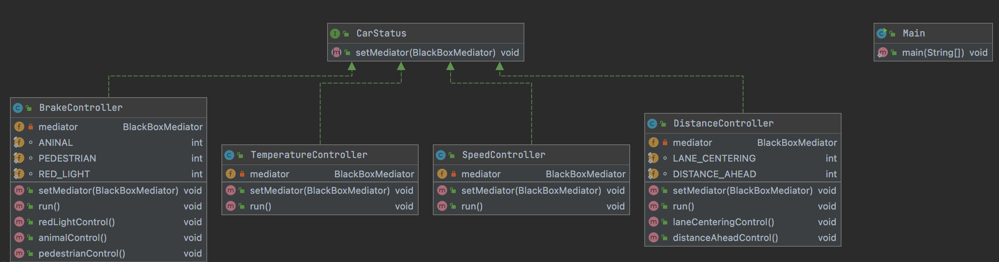
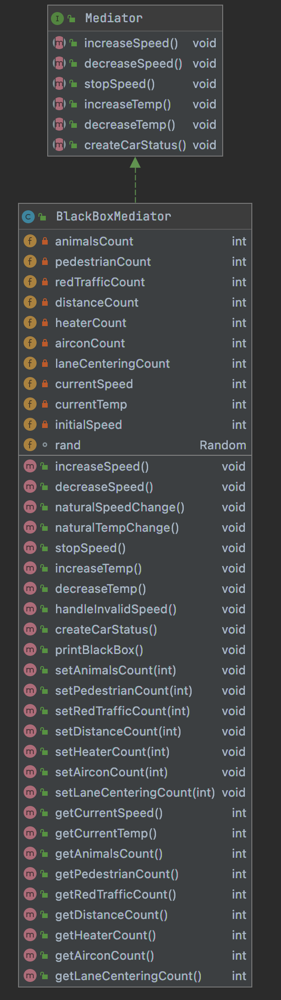
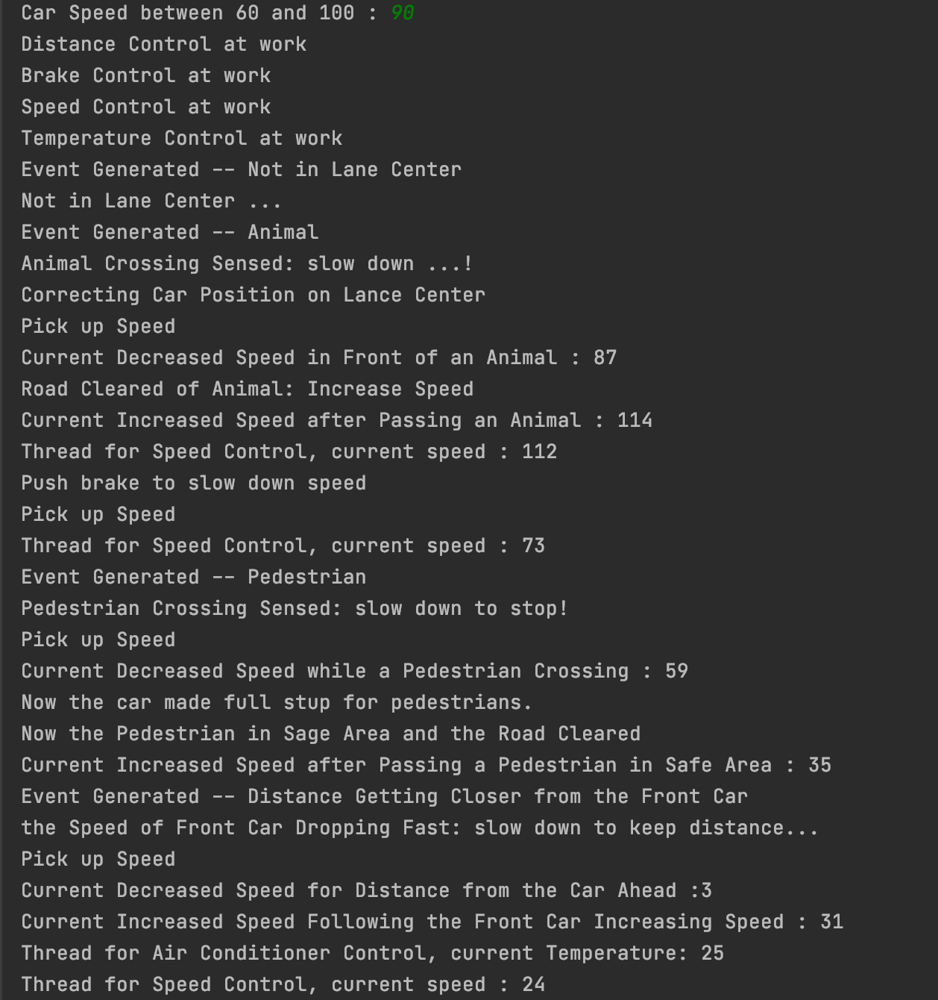
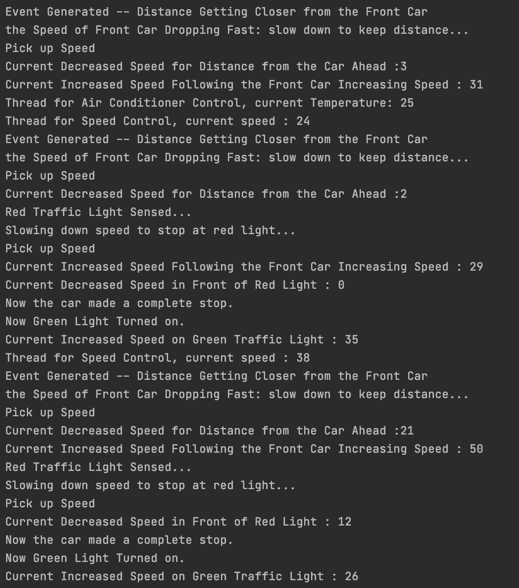
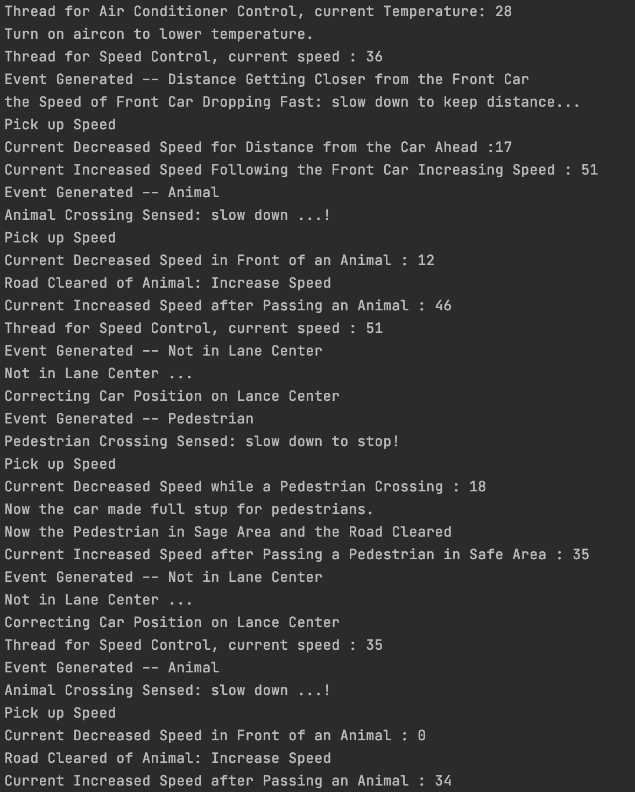
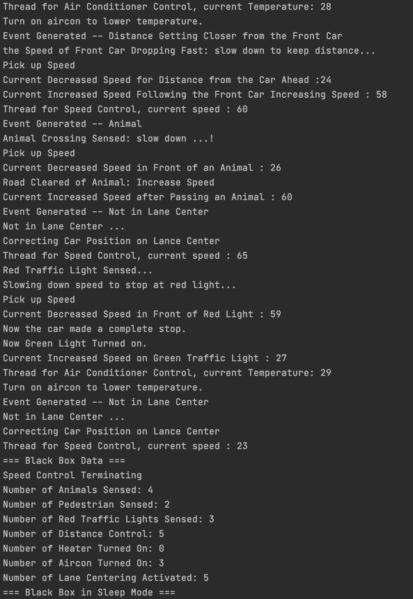
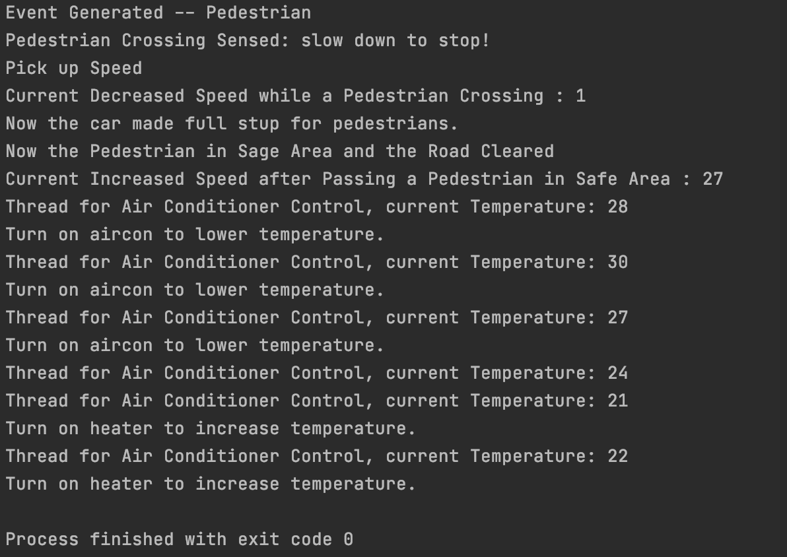

# Mediator - Design

Mediator 는 '중개자' 라는 뜻으로 실제적인 조정을 각각의 기능에서 하는 것이 아니라, 중개인 객체에서 하도록 하는 방법입니다. 중개자를 제외한 다른 객체들은 실제 값의 상태에 관여하지 않고 중개자에게 자신의 행동을 보고합니다. 중개자는 자신이 보고받은 내용에 따라서 행동을 결정하고 수행합니다. 이 프로그램은 Mediator 패턴을 통해 자율자동차의 동작을 시뮬레이션 합니다. 이 프로그램은 메인 쓰레드를 제외하고 4개의 쓰레드가 동시에 실행되며 Mediator 객체에게 자신의 행동을 보고합니다. Mediator 객체는 이 행동에 따라 자율 자동차의 속도와 차내 온도를 조절합니다. 이러한 구조는 각 쓰레드들이 서로가 어떤 상황에 있는지 신경쓰지 않아도 되게 합니다.

## UML

| Threads                                    | Mediator                                   |
| ------------------------------------------ | ------------------------------------------ |
|  |  |

## Detail Description

메인 클래스를 제외한 주요 클래스들의 기능과 필드 메서드, 변수의 의미를 정리합니다. getter와 setter는 생략했습니다.

### Mediator

중개자 객체의 인터페이스로 자율 자동차의 속도와 온도를 조절하기 위한 메서드들의 추상형 메서드를 정의합니다.

#### Methods

1. increaseSpeed

   추상형 메서드로 자동차의 속도를 증가시킵니다.

2. decreaseSpeed

   추상형 메서드로 자동차의 속도를 감소시킵니다.

3. stopSpeed

   추상형 메서드로 자동차를 완전히 멈추게 합니다.

4. increaseTemp

   추상형 메서드로 자동차 내의 온도를 증가시킵니다.

5. decreaseTemp

   추상형 메서드로 자동차 내의 온도를 감소시킵니다.

6. createCarStatus

   추상형 메서드로 자동차의 상태를 변화시킬 객체들을 생성합니다.

### CarStatus

자동차의 상태를 변화시킬 객체에 사용할 인터페이스 입니다. 각 상태는 중개자에게 자신의 행동을 보고해야하기 떄문에 mediator 객체를 설정하는 메서드를 필수적으로 포함해야합니다.

#### Methods

1. setMediator

   이 인터페이스를 implement 하는 모든 객체는 setMediator 메서드를 통해 중개자가 누구인지 지정해야합니다.

### BlackBoxMediator

Mediator 를 implement 하는 실제적인 중개자 역할을 하는 클래스 입니다. 속도와 온도의 증감은 모두 이 클래스의 인스턴스를 통해 이루어집니다.

#### Variables

1.  animalCount : int

    자동차가 시뮬레이션 중 동물을 만난 이벤트의 횟수를 기록합니다.

2.  pedestrianCount : int

    자동차가 시뮬레이션 중 보행자을 만난 이벤트의 횟수를 기록합니다.

3.  redTrafficCount : int

    자동차가 시뮬레이션 중 붉은색 신호를 만나 정차한 횟수를 기록합니다.

4.  distanceCount : int

    자동차가 시뮬레이션 중 앞 차와의 간격이 너무 가까워 감속했던 횟수를 기록합니다.

5.  heaterCount : int

    자동차가 시뮬레이션 중 온도가 낮아져 히터를 켰던 횟수를 기록합니다.

6.  airconCount : int

    자동차가 시뮬레이션 중 온도가 높아져 에어컨을 켰던 횟수를 기록합니다.

7.  laneCenteringCount : int

    자동차가 시뮬레이션 중 차선 중앙을 벗어난 횟수를 기록합니다.

8.  currentSpeed : int

    자동차의 현재 속도를 기록합니다.

9.  currentTemp : int

    자동차의 현재 차내 온도를 기록합니다.

10. initialSpeed : int

    사용자가 설정한 자동차의 초기 속도를 기록합니다.

11. rand : Random

    속도 및 온도 변화를 위해 사용할 난수를 생성하기 위한 변수입니다.

#### Methods

1. BlackBoxMediator(initalSpeed : int) : void

   생성자 메서드로 사용자가 입력한 초기 속도를 저장하고 초기 온도를 설정합니다. 그 이후에 자동차의 상태를 변화시킬 객체들을 생성하는 createCatStatus 메서드를 호출합니다.

2. increaseSpeed() : void

   자동차의 속도를 증가시킵니다. 자동차의 초기속도/2 +- 10 만큼의 범위 내에서 랜덤하게 속도를 골라 현재 속도에 더합니다.

3. decreaseSpeed() : void

   자동차의 속도를 감소시킵니다. 자동차의 초기속도/2 +- 10 만큼의 범위 내에서 랜덤하게 속도를 골라 현재 속도에서 뺍니다.

4. naturalSpeedChange() : void

   자연스러운 자동차의 속도 증감을 만들어냅니다. 현재 속도에서 -10 ~ +10 의 범위 에서 랜덤한 속도를 골라 더해줍니다.

5. stopSpeed() : void

   자동차의 현재 속도를 0으로 만듭니다.

6. increaseTemp() : void

   자동차의 온도를 현재 온도 1 ~ 3 만큼의 범위 내에서 랜덤하게 골라 증가시킵니다.

7. decreaseTemp() : void

   자동차의 온도를 현재 온도 1 ~ 3 만큼의 범위 내에서 랜덤하게 골라 감소시킵니다.

8. naturalTempChange() : void

   자동차의 온도를 -3 ~ +3 범위 내에서 랜덤하게 골라 현재 온도에 더해줍니다.

9. handleInvalidSpeed() : void

   자동차의 속도가 음수로 감속되는 것은 불가능 하기 때문에 만약 현재 속도가 음수라면 현재속도를 0으로 변환시켜줍니다.

10. createCarStatus() : void

    자동차의 상태를 변화시킬 4개의 쓰레드를 생성하고 실행시킵니다. 쓰레드가 시작된 이후에는 곧바로 종료하지 않고 우선순위가 가장 높음 SpeedController 쓰레드가 종료될 때 까지 기다리고, 해당 쓰레드가 종료된 이후에는 현재까지 블랙박스에 기록된 각 이벤트들의 횟수를 출력합니다.

11. printBlackBox() : void

    현재까지 블랙박스에 저장된 각 이벤트들의 횟수를 출력합니다.

### SpeedController

자동차의 속도를 총 10회에 걸쳐 지속적으로 변화시키고 만약 자동차가 최고 속도인 100을 초과하면 중개자 객체에게 속도의 감속을 요청합니다. 이 객체는 매 반복마다 200ms의 딜레이를 가지게 되어 높은 우선순위로 실행됩니다.

#### Variables

1. mediator : BlackBoxMediator

   이 객체에서 처리를 요청할 중개자를 저장하는 변수입니다. BlackBoxMediator 가 저장되어 속도의 변화가 필요하면 중개자에게 해당 행동을 요청하게 됩니다.

#### Methods

1. setMediator(mediator : BlackBoxMediator) : void

   생성자에서 전달된 중개자 객체를 저장합니다.

2. run() : void

   쓰레드를 실행합니다. 10번의 루프를 반복하고 저장된 중개자 객체에 naturalSpeedChange() 를 요청해서 자동차의 속도를 계속해서 변경시킵니다. 만약 변경된 자동차의 속도가 최고 속도인 100을 넘게되면 decreaseSpeed() 를 중개자에게 요청합니다.

### TemperatureController

자동차의 차 내 온도를 총 10회에 걸쳐 지속적으로 변화시키고 만약 자동차의 내부 온도가 23 미만이 되면 히터를, 26 초과가 되면 에어컨을 틀어 온도를 다시 변화시킵니다. 이 객체는 매 반복마다 500ms 의 딜레이를 가지게 되어 낮은 우선순위로 실행됩니다.

#### Variables

1. mediator : BlackBoxMediator

   이 객체에서 처리를 요청할 중개자를 저장하는 변수입니다. BlackBoxMediator 가 저장되어 온도의 변화가 필요하면 중개자에게 해당 행동을 요청하게 됩니다.

#### Methods

1. setMediator(mediator : BlackBoxMediator) : void

   생성자에서 전달된 중개자 객체를 저장합니다.

2. run() : void

   쓰레드를 실행합니다. 10번의 루프를 반복하고 저장된 중개자 객체에 naturalTempChange() 를 요청해서 자동차의 속도를 계속해서 변경시킵니다. 만약 변경된 자동차의 온도가 23 미만이면 히터를, 26 초과면 에어컨을 키는 이벤트를 발생시킵니다. 이때는 increaseTemp() 와 decreaseTemp() 를 중개자에게 요청합니다.

### BrakeController

자동차가 속도를 줄여야 하는 이벤트를 랜덤하게 발생시킵니다. 동물을 만났을 때, 보행자를 만났을 때, 빨간색 신호등을 만났을 때, 총 3개의 이벤트가 랜덤하게 발생하고 각 이벤트를 처리하기 위한 속도 감속 요청을 중개자 객체에 요청하게 됩니다. 이 객체는 매 반복마다 200ms 의 딜레이를 가지게 되어 높은 우선순위로 실행됩니다.

#### Variables

1. mediator : BlackBoxMediator

   이 객체에서 처리를 요청할 중개자를 저장하는 변수입니다. BlackBoxMediator 가 저장되어 속도의 변화가 필요하면 중개자에게 해당 행동을 요청하게 됩니다.

#### Methods

1. setMediator(mediator : BlackBoxMediator) : void

   생성자에서 전달된 중개자 객체를 저장합니다.

2. run() : void

   쓰레드를 실행합니다. 10번의 루프를 반복하고 매 반복마다 0 ~ 2 중의 자연수 난수를 생성해서 이벤트를 발생시킵니다. 0번은 동물이 나타났을 때, 1번은 보행자가 나타났을 때, 2번은 붉은색 신호를 만났을 때를 의미합니다.

3. animalControl() : void

   동물을 만났을 때의 이벤트를 정의합니다. 먼저, 이벤트 발생 횟수를 증가시키고 중개자에게 decreaseSpeed() 를 요청해서 속도를 감속시킵니다. 감속 후 동물이 지나갔다는 메세지가 출력된 이후에 중개자에게 increaseSpeed() 를 요청해서 속도를 다시 증가시킵니다.

4. pedestrianControl() : void

   보행자를 만났을 때의 이벤트를 정의합니다. 먼저, 이벤트 발생 횟수를 증가시키고 중개자에게 decreaseSpeed() 를 요청해서 속도를 감속시킵니다. 감속 후에는 차량이 완전히 정차했다는 메세지와 함께 stopSpeed() 를 요청해서 현재 속도를 0으로 갱신합니다. 이후에 보행자가 무사히 지나갔다는 메시지가 출력되면 다시 increaseSpeed() 를 중개자에게 요청하여 속도를 증가시킵니다.

5. redLightControl() : void

   붉은 신호등을 만났을 때의 이벤트를 정의합니다. 먼저, 이벤트 발생 횟수를 증가시키고 중개자에게 decreaseSpeed() 를 요청해서 속도를 감속시킵니다. 감속 후에는 차량이 완전히 정차했다는 메세지와 함께 stopSpeed() 를 요청해서 현재 속도를 0으로 갱신합니다. 이후에 녹생등이 켜졌다는 메세지와 함께 다시 increaseSpeed() 를 중개자에게 요청하여 속도를 증가시킵니다.

### DistanceController

자동차가 움직임을 변화시키는 이벤트를 랜덤하게 발생시킵니다. 총 2개의 이벤트가 랜덤하게 발생하고 각 이벤트를 처리하기 위한 속도 감속 요청을 중개자 객체에 요청하게 됩니다.

#### Variables

1. mediator : BlackBoxMediator

   이 객체에서 처리를 요청할 중개자를 저장하는 변수입니다. BlackBoxMediator 가 저장되어 온도의 변화가 필요하면 중개자에게 해당 행동을 요청하게 됩니다.

#### Methods

1. setMediator(mediator : BlackBoxMediator) : void

   생성자에서 전달된 중개자 객체를 저장합니다.

2. run() : void

   쓰레드를 실행합니다. 10번의 루프를 반복하고 매 반복마다 0 ~ 1 중의 자연수 난수를 생성해서 이벤트를 발생시킵니다. 0번은 차량을 차선 중앙으로 다시 옮겨야하는 이벤트, 1번은 앞 차와의 간격을 늘리기 위해서 속도를 줄이는 이벤트입니다.

3. laneCenteringControl() : void

   차량이 차선 중앙에 있지 않을 때의 이벤트를 발생시킵니다. 이벤트의 발생 횟수를 증가시키고 차량의 움직임에 대한 메세지를 출력합니다.

4. distanceAheadControl() : void

   앞 차량과의 거리가 너무 좁을 때의 이벤트를 발생시킵니다. 먼저, 이벤트의 발생 횟수를 증가시킵니다. 그 후, 앞 차와 거리를 벌려야 된다는 메세지와 함께 중개자에게 decreaseSpeed() 를 요청하여 속도를 줄이고, 메세지를 출력하고 increaseSpeed() 를 중개자에게 요청하여 속도를 증가시킵니다.

## Sample Result

| 1                                         | 2                                         |
| ----------------------------------------- | ----------------------------------------- |
|  |  |

| 3                                         | 4                                         |
| ----------------------------------------- | ----------------------------------------- |
|  |  |

| 7                                         |     |
| ----------------------------------------- | --- |
|  |     |
