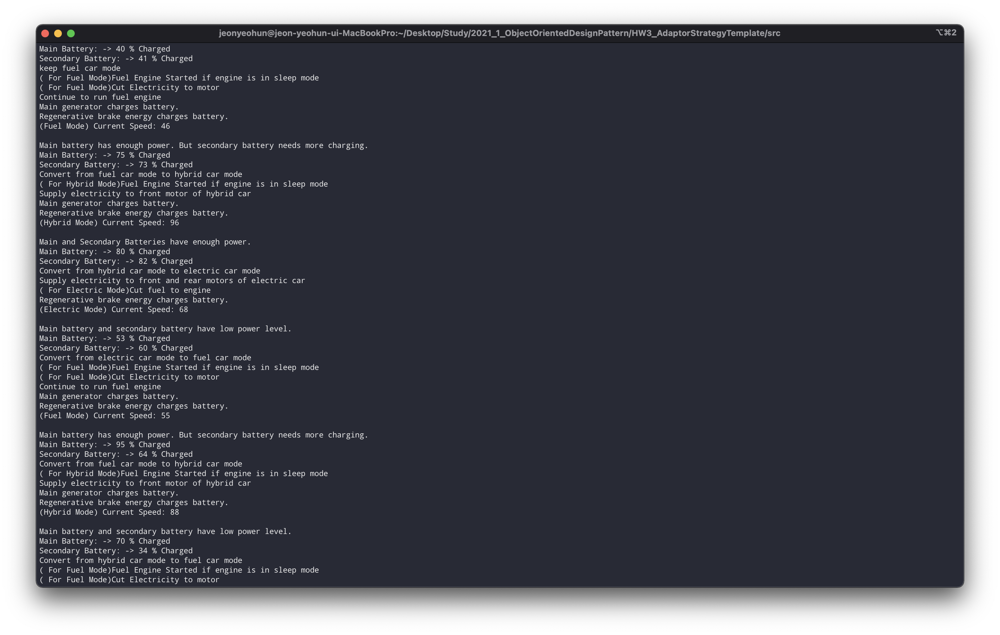

## UML


## Detail Description

### Adaptor Pattern

Adaptor 패턴은 한 클래스의 인터페이스를 호환성이 없는 다른 클래스가 사용할 수 있도록 변환하는 것을 의미합니다.

```java
FuelCar car = new CarAdaptor(new ElectricModeStrategyStrategy(prevMode));
car.runVehicle();
```

메인 함수에서 모든 자동차 종류들을 CarAdaptor를 통해 Fuel Car 형식으로 변환되고, Fuel Car 를 통해 각각의 메인 로직을 실행합니다.

어댑터의 내부는 아래와 같이 만들어져 있습니다.

```java
ModeStrategy strategy;

public CarAdaptor(ModeStrategy strategy){
   this.strategy = strategy;
}

@Override
public void runVehicle() {
   strategy.runVehicle();
}
```

모든 차종은 ModeStrategy를 상속하기에 어떤 클래스를 받든 해당 클래스 내부에 있는 `runVehicle` 메서드를 호출하게 됩니다.

### Template Method

템플릿 메서드 패턴은 메서드의 알고리즘을 기본 틀을 잡아주는 역할을 합니다. 차량 시뮬레이션은 아래와 같은 단계로 진행됩니다.

1. 모드 변경
2. 엔진 시작
3. 전기 공급 혹은 전기 차단
4. 가스 공급 혹은 가스 차단
5. 전력 충전
6. 브레이크 전력 충전
7. 속도 측정

따라서 이를 아래와 같은 템플릿 메서드로 만들어 사용합니다.

```java
void runVehicle(){
   convertMode();
   startEngine();
   manageElectricity();
   manageFuel();
   generateCharge();
   generateBrakeEnergyCharge();
   checkSpeed();
}
```

모든 클래스들은 위 순서대로 알고리즘을 실행하고, 각 메서드의 내부는 클래스에 맞게 직접 구현합니다.

따라서 각 클래스들은 추상메서드들을 정의한 후단순히 템플릿 메서드를 호출하는 것으로 자신의 상황에 맞는 알고리즘을 수행할 수 있습니다.

## Strategy Pattern

Strategy 패턴은 컨텍스트에 맞게 유연한 클래스를 사용할 수 있도록 하는 방법론입니다. 이 프로젝트에서 Strategy 패턴은 다수의 어댑터를 만들지 않고 단일한 어댑터로 사용자가 주입한 객체에 맞게 Fuel Car 를 생성하는 역할을 합니다.

```java
ModeStrategy strategy;

public Caradaptor(ModeStrategy strategy){
   this.strategy = strategy;
}

@Override
public void runVehicle() {
   strategy.runVehicle();
}
```

위 코드에서 runVehicle 이 전기자동차나 하이브리드 자동차 클래스와 관계없이 Fuel Car 의 runVehicle 로 주입될 수 있는 이유는 각 클래스가 ModeStrategy 인터페이스를 구현하고 있기 때문입니다.

## Running Example


